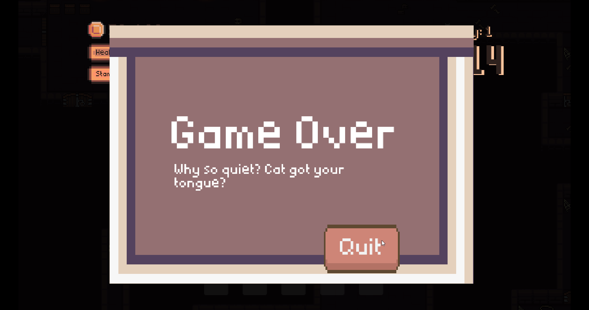

# Scai - 🏆 Best Use Of AI & Best Trailer @ Games Fleadh 2024 🏆
- An immersive, chaotic RPG experience with AI-powered NPCs.

## Contributors
- Jenny Thao Huynh | C22448184 | TU856/2 | [Github](https://github.com/jenitaoo)
- Keith Salhani | C22322811 | TU857/2 | [Github](https://github.com/chubbyyb)

# Trailer of Gameplay

# Screenshots

	

# Description Of The Project
## Introduction
Created for Object Oriented Programming module during university & for an entry in Games Fleadh (Ireland's Digital Programming Festival). The goal with this game was to explore game development with AI and test the limits of how far we could go with it, specifically generative AI using large language models. We decided to develop a retro & chaotic RPG adventure game inspired by Risk of Rain, Lethal Company and Stardew Valley.

## Technical Choices
| Choice | Name | Why? |
|-----------|-----------|
| LLM | OpenAI API - GPT 3.5 Turbo | Large context window, which allows us to pass the AI more information
| Application Form | Windows Application | Widely used, we use Windows so it was easier to develop & test our game
| Game Engine | Godot | Lightweight & learning curve isn't too steep

## Game-Concept
Embark on a captivating journey in "Scai," a top-down, 2D pixel RPG adventure set amidst the lush landscapes, mysterious dungeons and a cosy town.

You wake up with no memory & nothing - no money, no sense of self and  besides a dinky old van & your old journal. All the pages are torn except for a map with crossed out locations and a town. With no ambitions and a curiosity about the only thing you left behind, you embark on a mission to travel to every location on the map - but you need gas money! The quota of money you have to make increases daily.

Each location has a dungeon where you navigate through the depths and survive enemies to gather treasures that slow you down, but treasures aren't just shiny artefacts; they're a collection of seemingly random, miscellaneous objects. Your challenge lies not only in uncovering these relics but also in understanding their true worth. Venturing back to the cosy town, you encounter a vibrant cast of townspeople, each adorned with distinct and colourful personalities.

Powered by advanced AI, these townsfolk serve as more than just merchants; they become dynamic entities with unique preferences and quirks. As you engage in barter and trade, your ability to adapt your bargaining technique becomes paramount. Whether charming a pretty lady or appealing to the logic of a stoic old man, every interaction shapes your journey and decides whether you've enough gas money to meet your quota!

## Genres
1) **Role-Playing Game (RPG)**
- Play into different personas and roles as you persuade the NPCs to give you high offers for your treasures.
2) **Adventure**
- Explore ancient forests & abandoned dungeons, discover mysterious treasures & encounter a range of diverse characters.
1) **Puzzle**
- Decode the value of seemingly random treasures, navigate the complexities of social interaction to secure the best deals. You've to be careful about which items you try sell to certain characters & adapt your bargaining style to match their personalities!
4) **Survival**
- Scavenge for treasures in the dungeons while surviving various enemies!
5) **Rogue-Like**
- Endlessly play and explore procedurally generated dungeons until you fail to meet the daily quota of money made.

## Gameplay
Every day in the game has a time limit which decreases every day - reach the daily quota of money earned in order to progress on to the next day or else it's game over! You can visit one location each day, each location has different a dungeon & different likelehoods of spawning ultra rare treasures which you can try sell off to the townsfolk at the end of the day. Be careful what you sell, in the dungeons you've to shoot & survive exploding cats and each treasure affects your stats. At the end of the day, have text conversations & barter with each of the various personalities in town and sell treasures to reach your daily quota.

# Instructions For Use
## Play The Game
(Currently, we haven't exported the latest version of the game (.exe).)
Step 1 - Download the .exe file
Step 2 - Create an [OpenAI account](https://auth.openai.com/authorize?client_id=DRivsnm2Mu42T3KOpqdtwB3NYviHYzwD&audience=https%3A%2F%2Fapi.openai.com%2Fv1&redirect_uri=https%3A%2F%2Fplatform.openai.com%2Fauth%2Fcallback&device_id=b40c6f1a-4458-4a7f-83ad-9afc7a6ea4e8&screen_hint=signup&max_age=0&scope=openid%20profile%20email%20offline_access&response_type=code&response_mode=query&state=LlZ2QlJnLjhrZUhQczFuMjBWdmtmMVNOaDV2bmc0Y21Pb1BPaHNKSTFXcQ%3D%3D&nonce=aUpYb2JKR1Roa1pNaE5WbW9wRGtTUkdkbVZaeEJuaFc3RFpZNWlNSjF5bw%3D%3D&code_challenge=HDnnKP0p7UZ32CNZvBA0AN0FGQfs2f8DufLqcPlfA-s&code_challenge_method=S256&auth0Client=eyJuYW1lIjoiYXV0aDAtc3BhLWpzIiwidmVyc2lvbiI6IjEuMjEuMCJ9)
Step 3 - Generate a API key, tutorial on that [here](https://elephas.app/blog/how-to-create-openai-api-keys-cl5c4f21d281431po7k8fgyol0)
Step 4 - Navigate to Scai/AI/token and paste your API key into the token file. 
Step 5 - Ensure you have internet while playing & enjoy! 
 

# How It Works
Everything in this game project are classes and objects. We're used to Godot terminology for now so we might refer to classes as "nodes" and the objects as "instances and a collection of classes as "scenes". 

Breaking down the game elements into classes and using encapsulation really helped us with making game development a lot more dynamic because we were essentially able to "drag and drop" different elements of the game & reuse them. E.g. the player class encapsulates all the subclasses, variables & methods associated with it and is dragged into several different scenes.

In our repo, every object is saved with the following folder layout:
Objects/
-> Name/
	--> Scene, Script
	 -> Assets/
		 - -> All the textures

## AI NPC's & Bartering System
We are using the OpenAI API to call GPT3.5 Turbo in order to connect it to our game. We chose this model as it has a large context window, which allows us to pass the AI more information.

Each Non-Player Character (NPC) is equipped with a detailed prompt engineered to its unique personality traits, preferred responses to player interactions, error case handling and pricing strategies for items.

During player-NPC interactions, contextual information about the item(s) is relayed to the NPC to prevent the player from selling items for significantly more than their actual value.

NPC communication with the player occurs via pop-up messages, and the system interprets various triggers such as the NPC's current mood, desired price for items, and actions such as calling guards or agreeing to a deal using regex processing.

When a deal is triggered, the selected items are removed from the players inventory and the agreed value of the deal is transferred to the players wallet.

## Stat Bank And Effective Treasures
[Diagram](https://imgur.com/a/7r03hpi)
We wanted to have a very large number of items, and creating a new object for each item is time consuming, so we made a json file with all the item information, and a base node that inherits from the json file. The json file has 3 sections, which are the rarities, the code is implemented in godot to make that work. 

We decided to consolidate all player-affecting stats within a designated node "StatBank." This node serves as the central repository for all relevant stats, accessible by various game elements. For instance, when the player needs to retrieve their speed, they interact directly with this node.

This centralized approach proves vital as it facilitates the seamless transfer of collected treasures directly to a single node, preventing the fragmentation of stats throughout the game world. 

The treasures when picked up or dropped impact the StatBank
Everything else inherits from StatBank

We also wanted to preserve treasure info incase we dropped the treasure again, we implemented an initialization function within the treasures script. This function enables us to easily apply the current treasure's info (self.info) to any newly acquired treasure added to our inventory or dropped on the floor. For example, when we drop a treasure, we create a new instance, call the init function with the current info, and then destroy the current instance.

See the Google Sheets we used to organise treasure data before creating a json file [here](https://docs.google.com/spreadsheets/d/1KSMvTxMwG0vNtmLA9Kzll2xNiqJgOkUOx4N7_deNGUY/edit?usp=sharing):

## Exploding Cats
The cat uses the A* algorithm to navigate around the dungeon and avoid walls. The cat does not attack you until you are close to it, at which point it will dash and explode on you.

## Randomly Spawned Treasures and Enemies
In the forest & dungeon map, we spawn a certain amount of treasures & enemies in random positions on the map. In future development we would customise the amount of treasures & enemies to the difficulty of the location but we only have the forest for now.

We generate a random coordinate and check if that coordinate it suitable for generation (e.g isn't a cliffside, isn't on a rock, isn't a wall) and then generate the treasure there.

## Procedurally Generated Dungeons (Unused In Demo)
This feature unfortunately was unusable for the beta but a lot of work was put into it so I'm keeping it here! Theoretically it should've worked, in practice? It did not. If you'd like to see the attempt, it's in Dungeon.tscn and Dungeon.gd. 

We wanted to procedurally generate the dungeons for each day, the locations on the map e.g Forest, would be manually made but the Dungeon's found inside the maps were meant to be procedurally generated for replayability and chaos.

First, we needed to generate outlines for rooms with random dimensions using Godot's RigidBody2D nodes for each room as they have built-in physics properties that allow the rectangles to seperate from each other. Then we delete half the room outlines to allow for gaps between the rooms. 
Next, we use Godot's AStar2D to turn these rooms into points in a graph and then use an Prim-Dijkstra's algorithm to connect these points (Minimum Spanning Tree). 
[Here's a link to what this looked like for us](https://imgur.com/a/Yugsrkb)

Using these rooms and paths, we generate the tilemap cells for the rooms and paths between rooms using terrains (Godot's autotiling feature). This was the tricky part and we didn't quite nail paths between rooms.

# List Of Assets Used
## Audio
Jenny created the background music using Bosca Ceoil, a music composition tool, with nothing but a sprinkle music theory and a dream - to create something playful and chaotic that fit Scai. [Have a listen :>](BackgroundMusic/Scai.wav)

## Visual
We chose Itch.io to source our asset packs because of their quality and ease of implementing in our game. We used a huge number of asset packs but modified them, their shapes & colours using Aseprite in order for our game to look visually cohesive & to suit our artistic vision. We wanted to go for a cosy, earthy feeling for the town & forest map but a spookier and darker look for the dungeon map.

# What I am most proud of in the assignment
## Jenny
With no experience in game development, familiarising myself with a game engine and learning how to use the different elements of game development such as using animation trees, scenes, nodes, objects, tilemaps, collision shapes, light occluders, pathfinding, soundtrack development etc is something that I'm definitely proud of. 

This is the largest and most complex project that I've developed so far and I'm most proud of the skills I gained in collaborating using Git & avoiding merge conflicts along with programming several different classes and having them all work together across different scenes such as how the player and it's subclasses the money counter, stamina bar, health bar, stats (fire rate, HP cap & gain, stamina cap & gain, speed), inventory, gun, UI interact with other objects across different scenes. I'm very proud of being able to create gameplay with a clear flow from start, middle and end too.

# What I learned
## Jenny
- How to use the Godot game engine
	- Tilesets, tilemaps, animation trees, spritesheets, collision shapes, z-index, y-sorting, signals, a*, trees, autoload singletons.
- Practical application of polymorphism, singletons, encapsulation, inheritance, abstraction and how an object-oriented approach helps with reusability of code, reduction of repitition.
- It helps to plan ahead and draft class diagrams so you get an idea of how the classes interact with each other.
- When collaborating, especially when using Git, it's important to clearly define tasks for each person and the files they work in. Also helps to regularly communicate goals and current tasks.
- Make commits and pushes regularly. Never commit a secret API key. Git will not let you push your 9 hours of work.
- If you're having problems with Git, the answer is probably on the internet (thank you reflog)

# References 
-

# Proposal submitted earlier can go here (if there is one):
[Design Document at the time of Games Fleadh](DesignDocument.md)